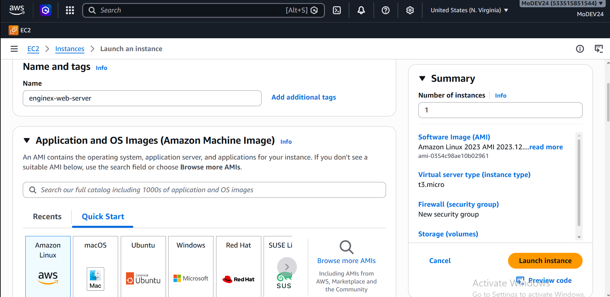

# EC2 Web Application Deployment Using Vim and Nginx

This section documents how to deploy a simple web application on an Amazon EC2 Linux instance using Nginx as the web server and Vim as the text editor.

The process starts by creating an EC2 instance from the AWS Console, connecting to the instance from a Windows computer using Git Bash and SSH, installing Nginx, checking the default Nginx web page, and then replacing that default page with a new HTML page.

The overall process is:

AWS Console
     ↓
Create EC2 Instance
     ↓
Configure Security Group
     ↓
Obtain Public IP / DNS
     ↓
Git Bash on Windows
     ↓
SSH into EC2
     ↓
Linux Terminal
     ↓
Install Nginx
     ↓
Open Default Web Page
     ↓
Use Vim to Edit HTML
     ↓
Replace Default Page
     ↓
Save Changes
     ↓
Refresh Browser
     ↓
New Website Appears

---

1. What Are EC2, Nginx and Vim?

Before starting the deployment, it is important to understand what each component does.

Amazon EC2

Amazon EC2 (Elastic Compute Cloud) provides virtual servers in the AWS Cloud.

The EC2 instance acts as the computer on which the website will run.

Instead of hosting the website on your personal computer, the website files are placed on the EC2 server.

Your Computer
     |
     | SSH
     ↓
AWS EC2 Linux Server
     |
     ↓
Nginx
     |
     ↓
Website Files
     |
     ↓
Website

Nginx

Nginx is a web server.

Its job in this project is to receive requests from a browser and return the appropriate website files.

For example, when someone visits:

http://YOUR-EC2-PUBLIC-IP

the request reaches the EC2 instance.

Nginx receives the request and looks for the website files in its configured web root.

It then sends the requested HTML, CSS, JavaScript, images, and other files back to the browser.

Vim

Vim is a terminal-based text editor.

It allows you to create and modify files directly from the Linux terminal.

For example:

sudo vim /var/www/html/index.html

opens the HTML file inside Vim.

You can then modify the HTML without needing a graphical text editor.

---

2. Create the EC2 Instance

The first stage is to create the Linux server that will host the website.

Step 1: Open the AWS Console

Sign in to the AWS Management Console.

Open:

EC2

Then select the appropriate AWS Region.

The Region determines where the EC2 resources will be created.

---

Step 2: Choose "Launch Instance"

From the EC2 dashboard, select the option to launch a new instance.

The exact appearance of the AWS Console can change over time, so the button names or layout may differ slightly.

---

Step 3: Give the Instance a Name

Under the instance name field, enter a descriptive name.

For example:

nginx-web-server

A meaningful name makes it easier to identify the server later.

---

Step 4: Select an Operating System

Choose a Linux-based AMI.

For this documentation, either of the following can be used:

- Ubuntu
- Amazon Linux

The commands later in this guide differ slightly depending on which one you choose.

For a beginner Linux deployment exercise, Ubuntu is a straightforward choice.

---

Step 5: Choose the Instance Type

Select an instance type appropriate for the exercise.

For a simple static website demonstration, a small instance is generally sufficient.

Always check the current AWS pricing and Free Tier/credit eligibility associated with your account before launching resources.

«Important: "Free Tier eligible" does not necessarily mean every resource or usage associated with the project is free.»

---

Step 6: Create or Select a Key Pair

A key pair is used to authenticate your SSH connection to the Linux server.

If you do not already have an appropriate key pair:

1. Choose to create a new key pair.
2. Give it a recognizable name.
3. Download the private key.
4. Store the private key securely.

For example:

nginx-project-key.pem

The ".pem" file is the private key used when connecting through SSH.

Do not upload your private key to GitHub.

---

3. Configure the Security Group

A security group acts as a virtual firewall for an EC2 instance.

For this project, two important inbound connections are:

Type| Port| Purpose
SSH| "22"| Connect to the Linux server
HTTP| "80"| Allow browsers to access the website

SSH — Port 22

SSH allows you to connect from your computer to the EC2 server.

For a normal SSH connection from your computer, AWS recommends restricting SSH access to your computer's public IP/range rather than leaving SSH open to everyone.

HTTP — Port 80

HTTP port "80" allows browsers to reach the web server.

The security group therefore needs to permit HTTP traffic if you want to open the website through its public IP.

---

4. Launch the Instance

Review the configuration and launch the instance.

Wait until the instance reaches a running state.

Then select the instance and locate:

Public IPv4 address

For example:

18.xxx.xxx.xxx

You may also see a public DNS hostname.

You will use one of these addresses when connecting to the server.

---

5. Open Git Bash on Windows

On your Windows computer, open Git Bash.

Git Bash provides a Bash-style terminal environment on Windows and can be used to run SSH commands.

First, check that SSH is available:

ssh

If SSH is installed correctly, Git Bash should display information about the SSH command.

---

6. Navigate to Your SSH Key

You need to access the ".pem" file you downloaded when creating the EC2 instance.

For example:

cd Downloads

Check the directory:

ls

You should see your key:

nginx-project-key.pem

If your key is stored somewhere else, navigate to that location instead.

You can check your current location with:

pwd

---

7. Connect to the EC2 Instance Using SSH

The general SSH structure is:

ssh -i "YOUR-KEY.pem" USERNAME@PUBLIC-IP

For an Ubuntu instance:

ssh -i "nginx-project-key.pem" ubuntu@YOUR-PUBLIC-IP

For an Amazon Linux instance:

ssh -i "nginx-project-key.pem" ec2-user@YOUR-PUBLIC-IP

The username depends on the AMI used to create the instance. AWS lists "ubuntu" for Ubuntu and "ec2-user" for Amazon Linux.

For example:

ssh -i "nginx-project-key.pem" ubuntu@18.xxx.xxx.xxx

The first time you connect, SSH may ask you to confirm the host.

Type:

yes

if you recognize and expect the connection.

Once connected, your terminal is no longer operating on your Windows computer.

You are now controlling the Linux EC2 server.

---

8. Confirm That You Are Inside the EC2 Server

Run:

pwd

You can also run:

ls

Your terminal prompt should indicate the Linux user and server.

For example:

ubuntu@ip-172-31-xx-xx:~$

This is an important distinction:

Git Bash
   ↓
SSH
   ↓
EC2 Linux Terminal

Commands typed after the SSH connection are being executed on the EC2 server.

---

9. Update the Linux Package Information

Before installing software, update the package information.

Ubuntu

sudo apt update

Amazon Linux

sudo dnf update -y

The exact package-management command depends on the Linux distribution.

---

10. Install Nginx

Ubuntu

Install Nginx with:

sudo apt install nginx -y

Amazon Linux

On Amazon Linux, the package-management command may use "dnf":

sudo dnf install nginx -y

After installation, start Nginx:

sudo systemctl start nginx

Enable it to start automatically when the server boots:

sudo systemctl enable nginx

Check its status:

sudo systemctl status nginx

You should see that the service is running.

---

11. Test the Default Nginx Website

Now copy the EC2 instance's public IPv4 address.

Open a browser on your computer and enter:

http://YOUR-PUBLIC-IP

For example:

http://18.xxx.xxx.xxx

If everything is configured correctly, Nginx should return its default website.

Depending on the Linux distribution and configuration, the default page may display wording such as:

Welcome to nginx!

or another default/test page.

The important point is that the page is being served by Nginx.

At this stage:

Browser
   ↓
Public IP
   ↓
EC2
   ↓
Nginx
   ↓
Default Website

"Nginx Default Website" (images/nginx-default-page.png)

«Replace the image path above with your own screenshot.»

---

12. Understanding the Default Website

The page you are seeing is not coming from your Windows computer.

It is being served from the EC2 instance.

Nginx has a configured document root, which is the directory from which it serves website files.

Common paths include:

Ubuntu

/var/www/html/

Some other Linux/Nginx configurations

/usr/share/nginx/html/

The exact location can be checked from the Nginx configuration rather than assuming it.

You can inspect Nginx's configuration with commands such as:

sudo nginx -T

Then look for:

root

For example:

root /var/www/html;

This tells Nginx where to look for website files.

---

13. What Is the "index.html" File?

The main webpage is commonly represented by:

index.html

HTML contains the structure and content of a webpage.

For example:

<!DOCTYPE html>
<html>
<head>
    <title>My Website</title>
</head>

<body>
    <h1>Hello World</h1>
    
This website is running on AWS EC2.

</body>
</html>

When the browser requests the website, Nginx can return this file.

The important relationship is:

Browser
   ↓
Nginx
   ↓
Web Root
   ↓
index.html
   ↓
Browser displays HTML

---

14. Vim — The Terminal Text Editor

Vim allows you to edit website files directly inside the EC2 terminal.

For example:

sudo vim /var/www/html/index.html

The exact file path depends on the Nginx configuration and Linux distribution.

The command can be broken down as:

sudo
 ↓
Run with administrator privileges

vim
 ↓
Open the Vim text editor

/var/www/html/index.html
 ↓
File being edited

---

15. Understanding Vim Modes

Vim is different from normal graphical text editors because it uses modes.

The two most important modes for this exercise are:

Normal Mode

Used for commands such as saving, quitting, copying, deleting and navigating.

Insert Mode

Used to actually type or paste text into the file.

When Vim first opens, you are normally in Normal Mode.

To start typing:

i

The "i" command means:

Insert

You can then type or paste your HTML.

---

16. Put the New Website Into Vim

Suppose you obtained HTML from a repository.

For example, the repository may contain a webpage such as:

<!DOCTYPE html>
<html>
<head>
    <title>My New Website</title>
</head>

<body>
    <h1>My New Website</h1>
    
This page is now running on an AWS EC2 server.

</body>
</html>

You can open the website file:

sudo vim /var/www/html/index.html
 

Then:

1. Press "i".
2. Enter Insert Mode.
3. Select the old HTML.
4. Replace it with the new HTML.
5. Make any required changes.
c
This is the part where the original/default website is replaced by the new website.

---

17. Saving the File in Vim

After entering or pasting the HTML:

Step 1 — Leave Insert Mode

Press:

Esc

You are now back in Normal Mode.

Step 2 — Save

Type:

:w

Then press:

Enter

The "w" means:

write

which means save the file.

Step 3 — Save and Exit

You can use:

:wq

Then press:

Enter

This means:

write + quit

Another common method is:

ZZ

from Normal Mode.

---

18. If You Want to Exit Without Saving

If you made a mistake and want to discard the changes:

:q!

Then press:

Enter

Meaning:

q
↓
quit

!
↓
force the operation

So:

:q!

means:

Quit Vim without saving changes.

---

19. Vim Command Cheat Sheet

Command| Function
"i"| Enter Insert Mode
"Esc"| Return to Normal Mode
":w"| Save
":q"| Quit
":wq"| Save and quit
":q!"| Quit without saving
"dd"| Delete current line
"gg"| Go to beginning of file
"G"| Go to end of file
"u"| Undo
"Ctrl + r"| Redo

For this deployment, the most important commands are:

i
Esc
:w
:wq
:q!

---

20. Replacing the Default Website

The deployment now changes from:

EC2
 ↓
Nginx
 ↓
Default HTML
 ↓
"It works" / default Nginx page

to:

EC2
 ↓
Nginx
 ↓
Your HTML
 ↓
New Website

The process is:

sudo vim /var/www/html/index.html

Then:

i

Paste or type the new HTML.

Then:

Esc

Then:

:wq

Press:

Enter

---

21. Refresh the Website

Return to your browser.

Open:

http://YOUR-PUBLIC-IP

Refresh the page.

Instead of the previous default page, you should now see your new website.

For example:

BEFORE

EC2 → Nginx → Default Page

becomes:

AFTER

EC2 → Nginx → index.html → New Website

"Updated Website" (images/nginx-updated-website.png)

«Replace the image path with the screenshot of your own updated webpage.»

---

22. Where the Website Came From

If the HTML originally came from a GitHub repository, there are two different concepts that should not be confused.

Method 1 — Copy the HTML manually

You can open the repository, copy the HTML and paste it into Vim.

GitHub Repository
       ↓
Copy HTML
       ↓
Vim
       ↓
index.html
       ↓
Nginx

This is useful for learning Vim and understanding how the web server works.

Method 2 — Clone the Repository

A repository can also be downloaded directly onto the server using Git.

For example:

git clone https://github.com/USERNAME/REPOSITORY.git

This is a different deployment workflow.

For the Vim exercise, manually copying the HTML into the file is useful because it demonstrates the relationship between Vim → HTML → Nginx → Browser.

---

23. Vim and Nginx Are Different Things

It is important not to think of Vim and Nginx as the same tool.

Vim

Vim is the editor.

Its job is to modify files.

Vim
 ↓
Edit index.html

Nginx

Nginx is the web server.

Its job is to serve the files to visitors.

Browser
 ↓
Nginx
 ↓
index.html

Together:

             Vim
              ↓
       Edit index.html
              ↓
          Nginx
              ↓
         Serve HTML
              ↓
           Browser

---

24. Making Another Change

Suppose you want to change:

<h1>My New Website</h1>

to:

<h1>My AWS Web Application</h1>

Open the file again:

sudo vim /var/www/html/index.html

Press:

i

Make the change.

Then:

Esc

Save and exit:

:wq

Refresh the browser.

The new text should appear.

This demonstrates the basic deployment cycle:

Edit
 ↓
Save
 ↓
Nginx serves updated file
 ↓
Refresh browser
 ↓
Updated website

---

25. Do You Need to Restart Nginx After Every HTML Change?

Normally, no.

If you only changed the contents of an HTML file, Nginx generally does not need to be restarted.

For example:

sudo vim /var/www/html/index.html

Change the HTML, save it, and refresh the browser.

Nginx can serve the updated file.

A restart/reload becomes more relevant when you change Nginx's configuration, rather than simply changing the website's HTML.

---

26. Checking Nginx

Check whether Nginx is running:

sudo systemctl status nginx

You can also test the configuration:

sudo nginx -t

A successful configuration test should indicate that the syntax is okay.

If you modify an Nginx configuration file, you can reload Nginx:

sudo systemctl reload nginx

A reload is generally preferable to restarting the entire service when you only need Nginx to reread its configuration.

---

27. Useful Linux Commands During Deployment

These commands are useful when working with the website:

Show your current directory

pwd

List files

ls

Enter a directory

cd directory-name

Move up one directory

cd ..

Display a file

cat index.html

Edit a file

sudo vim index.html

Check Nginx status

sudo systemctl status nginx

Test Nginx configuration

sudo nginx -t

---

28. Common Problems

Problem 1 — The Website Does Not Open

Check the EC2 security group.

Make sure HTTP port:

80

is allowed.

Also make sure the instance is running and Nginx is active.

sudo systemctl status nginx

---

Problem 2 — SSH Does Not Connect

Check:

- EC2 instance is running.
- Correct public IP/DNS is being used.
- Correct username is being used.
- Correct ".pem" key is being used.
- Security group allows SSH on port "22".
- Your local network can reach the instance.

For example, Ubuntu normally uses:

ssh -i "key.pem" ubuntu@PUBLIC-IP

Amazon Linux normally uses:

ssh -i "key.pem" ec2-user@PUBLIC-IP

---

Problem 3 — Vim Says Permission Denied

The website directory may require administrator privileges.

Instead of:

vim /var/www/html/index.html

use:

sudo vim /var/www/html/index.html

---

Problem 4 — The Old Website Still Appears

First confirm that the correct file was edited.

Check:

cat /var/www/html/index.html

Then refresh the browser.

If the browser has cached the old page, perform a hard refresh.

Also confirm that the browser is accessing the correct EC2 public IP.

---

Problem 5 — Nginx Is Not Running

Check:

sudo systemctl status nginx

If necessary:

sudo systemctl start nginx

Then test the website again.

---

29. Four Important Deployment Layers

This project demonstrates several layers working together.

Layer 1 — AWS Infrastructure

EC2 Instance

Provides the virtual server.

Layer 2 — Linux

Ubuntu / Amazon Linux

Provides the operating system and terminal environment.

Layer 3 — Nginx

Nginx

Provides the web-server functionality.

Layer 4 — Website

HTML
CSS
JavaScript
Images

Provides the actual application/page being displayed.

The complete architecture is:

                 INTERNET
                     |
                     ↓
               Public IP
                     |
                     ↓
              EC2 Instance
                     |
                     ↓
                 Linux OS
                     |
                     ↓
                  Nginx
                     |
                     ↓
               Web Root
                     |
                     ↓
                index.html
                     |
                     ↓
                 WEBSITE

---

30. Deployment Summary

The complete workflow can be summarized as:

# Connect to the server
ssh -i "YOUR-KEY.pem" ubuntu@YOUR-PUBLIC-IP

# Update packages
sudo apt update

# Install Nginx
sudo apt install nginx -y

# Start Nginx
sudo systemctl start nginx

# Enable Nginx
sudo systemctl enable nginx

# Check Nginx
sudo systemctl status nginx

# Edit the website
sudo vim /var/www/html/index.html

Inside Vim:

i

Enter Insert Mode.

Add or paste the website HTML.

Then:

Esc
:wq
Enter

Finally, open:

http://YOUR-PUBLIC-IP

and refresh the page.

The result should be:

Default Nginx Page
        ↓
Edit index.html with Vim
        ↓
Save the file
        ↓
Nginx serves the new file
        ↓
Refresh browser
        ↓
New Website

"Deployment Result" (images/nginx-deployment-result.png)

«Replace this image path with your own final screenshot.»

---

31. Recommended Screenshots for This Documentation

Only a few screenshots are necessary for this project.

Screenshot 1 — EC2 Instance

Show the running EC2 instance and its public IP.

Screenshot 2 — Default Nginx Page

Show the default page before replacing it.

Screenshot 3 — Vim

Show the HTML being edited inside Vim.

Screenshot 4 — Final Website

Show the new webpage after saving the HTML and refreshing the browser.

You can replace the filenames above with your own screenshot filenames.

---

32. Final Understanding

This exercise demonstrates a basic real-world cloud deployment workflow.

You created a virtual server using Amazon EC2, connected to it using SSH through Git Bash, installed Nginx, and used Vim to modify the website files.

Initially, Nginx served its default page:

EC2
 ↓
Nginx
 ↓
Default Page

You then replaced the default HTML with your own webpage:

EC2
 ↓
Nginx
 ↓
Your index.html
 ↓
Your Website

The important distinction is:

«EC2 provides the server, Linux provides the operating environment, Nginx serves the website, and Vim lets you edit the website files.»

That is the fundamental relationship demonstrated by this deployment exercise.